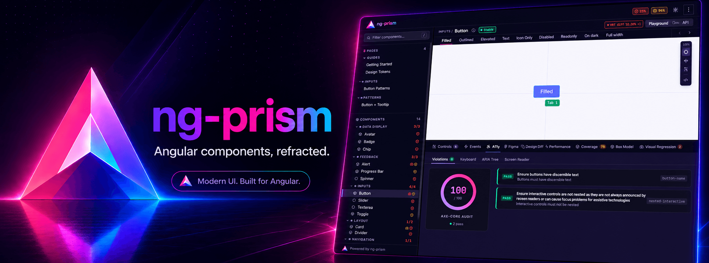

<p align="center">
  
</p>

# ng-prism

A component showcase for modern Angular, without story files.
You add one decorator to your component. ng-prism picks it up at build time and generates live controls, code snippets and docs from it.

[](https://www.npmjs.com/package/@ng-prism/core)
[](https://www.npmjs.com/package/@ng-prism/core)
[](https://angular.dev)
[](https://www.typescriptlang.org)
[](./LICENSE)

[Live demo](https://dyingangel666.github.io/ng-prism/demo/?component=ButtonComponent) · [Documentation](https://dyingangel666.github.io/ng-prism/)

<!-- TODO(maintainer): record a 10 to 15 s GIF: pick a component in the sidebar,
     switch the variant, change a control, watch the code snippet update.
     Save it as docs/demo.gif and uncomment the line below.
<p align="center"></p>
-->

## Same button, two approaches

<table>
<tr><th>Storybook</th><th>ng-prism</th></tr>
<tr>
<td valign="top">

```ts
// button.stories.ts (separate file)
import type { Meta, StoryObj } from '@storybook/angular';
import { ButtonComponent } from './button.component';

const meta: Meta<ButtonComponent> = {
    title: 'Atoms/Button',
    component: ButtonComponent,
    argTypes: {
        variant: {
            control: 'select',
            options: ['primary', 'secondary', 'danger']
        }
    }
};
export default meta;
type Story = StoryObj<ButtonComponent>;

export const Primary: Story = {
    args: { variant: 'primary', label: 'Click me' }
};
export const Danger: Story = {
    args: { variant: 'danger', disabled: true }
};
```

</td>
<td valign="top">

<!-- prettier-ignore -->
```ts
// button.component.ts (on the component itself)
@Showcase<ButtonComponent>({
    title: 'Button',
    category: 'Atoms',
    variants: [
        { name: 'Primary',
          inputs: { variant: 'primary', label: 'Click me' } },
        { name: 'Danger',
          inputs: { variant: 'danger', disabled: true } }
    ]
})
@Component({ /* ... */ })
export class ButtonComponent { /* ... */ }
```

The controls come from your `input()` types.
You don't need `argTypes` or an extra file, and the variants are type-checked.

</td>
</tr>
</table>

## Does `@Showcase` end up in my production bundle?

No, but that doesn't happen by itself.

At runtime the decorator does nothing. It takes your config, returns an empty function and stores nothing:

```ts
export function Showcase<T = unknown>(_config: ShowcaseConfig<T>): ClassDecorator {
    return () => {};
}
```

The prism builder reads all metadata at build time, directly from your source files via the TypeScript Compiler API. Nothing gets registered, reflected or looked up while your application runs.

The decorator call itself is still in your build output, though. When ng-packagr compiles your library, it turns the decorator into a top-level call. Tree-shaking has to treat a top-level call as a side effect, so it can't remove it:

```js
import { Showcase } from '@ng-prism/core';
Showcase({ title: 'Button', category: 'Atoms' })(ButtonComponent);
```

That's why ng-prism ships an AST transformer that removes these calls and their imports. `ng add` registers it as a `strip-showcase` script in your `package.json`:

```bash
ng build my-lib && npm run strip-showcase
```

After that, your published library doesn't reference `@ng-prism/core` anywhere, and `grep -r "@ng-prism/core" dist/my-lib/` returns nothing. Keep the package as a `devDependency`. People who install your library never see it.

The details, including Nx targets and how to use the transformer programmatically, are in [Publishing Libraries with @Showcase](https://dyingangel666.github.io/ng-prism/#/guide/library-publishing).

## Why not Storybook?

Storybook is a great tool. ng-prism deliberately covers less. It only supports Angular and tries to work the way Angular does.

|                     | Storybook                                 | ng-prism                                                            |
| ------------------- | ----------------------------------------- | ------------------------------------------------------------------- |
| Frameworks          | React, Vue, Angular and more              | Angular only                                                        |
| Where variants live | Separate `*.stories.ts`                   | On the component                                                    |
| Controls            | Configured via `argTypes` / Compodoc      | Inferred from `input()` signals                                     |
| Visual regression   | Chromatic (paid SaaS) or community addons | Official plugin, works with your own screenshot runner, no SaaS     |
| Accessibility       | `@storybook/addon-a11y`                   | Built in (axe-core)                                                 |
| Design handoff      | Design addons                             | Official Figma plugin, with an opt-in pixel diff against the design |
| Interaction tests   | Yes (play functions)                      | No                                                                  |
| Addon ecosystem     | Huge                                      | Small (official plugins)                                            |

Storybook is the better choice if you need several frameworks, its addons or interaction tests right now.
ng-prism makes sense if you use modern, signal-based Angular and want your showcase to stay in sync with your components without maintaining story files.

## Features

ng-prism scans your library at build time with the TypeScript Compiler API, so there is nothing to register. It works with `input()` and `output()` signals. If you pass the component as a generic (`@Showcase<MyComponent>`), you get autocomplete and compile-time checks for the variant `inputs`.

In the UI you get generated controls with an editor for each input type, plus an Angular template snippet per variant that updates while you change the controls. Every variant gets an axe-core audit, and that's part of the core, not a plugin. The visual regression plugin shows a diff report for each variant next to the live component. Your own screenshot runner writes a plain JSON report for it, and the example in the docs uses Playwright.

You can also showcase directives on a configurable host element and write your own demo pages for complex components. The URL always reflects the current component, variant and view, so you can share links to them. The UI is themed through CSS custom properties, and you can replace whole sections of it.

There are official plugins for JSDoc, Figma, performance, box model, coverage and visual regression.

## Quick Start

```bash
ng add @ng-prism/core      # creates the prism app, configures builders, generates ng-prism.config.ts
```

Add `@Showcase` to a component (see above), then run:

```bash
ng run my-lib:prism        # serves on http://localhost:4400
```

Your component shows up in the sidebar with live controls, code snippets and a tab per variant.

## Configuration

```typescript
// ng-prism.config.ts
import { defineConfig } from '@ng-prism/core/config';
import { jsDocPlugin } from '@ng-prism/plugin-jsdoc';

export default defineConfig({
    plugins: [jsDocPlugin()],

    theme: {
        '--prism-primary': '#00a67e',
        '--prism-font-sans': "'Inter', sans-serif"
    },

    appProviders: [provideAnimationsAsync(), provideHttpClient()]
});
```

## Directives

A directive needs a host element. You configure it with `host`:

```typescript
@Showcase({
  title: 'Tooltip',
  host: {
    selector: 'my-button',
    import: { name: 'ButtonComponent', from: 'my-lib' },
    inputs: { label: 'Hover me' },
  },
  variants: [
    { name: 'Top', inputs: { position: 'top', text: 'Tooltip!' } },
  ],
})
@Directive({ selector: '[myTooltip]' })
export class TooltipDirective { ... }
```

## Component Pages

Some components need projected content or mock data. For these you can register your own demo page:

```typescript
providePrism(PRISM_RUNTIME_MANIFEST, config, {
    componentPages: [{ title: 'Table Demo', category: 'Data', component: TableDemoPage }]
});
```

If you link the page to a component with `@Showcase`, you get the API docs and your custom page together:

```typescript
@Showcase({
  title: 'Table',
  renderPage: 'Table Demo',
  variants: [{ name: 'Default', inputs: { height: '400px' } }],
})
```

## Official Plugins

| Plugin            | Package                              | What it does                                                                                |
| ----------------- | ------------------------------------ | ------------------------------------------------------------------------------------------- |
| Visual Regression | `@ng-prism/plugin-visual-regression` | Diff report per variant, next to the live component. Works with your own screenshot runner. |
| JSDoc             | `@ng-prism/plugin-jsdoc`             | API tables generated from your JSDoc comments                                               |
| Figma             | `@ng-prism/plugin-figma`             | Shows the Figma frame next to the component, with an opt-in pixel diff against the design   |
| Coverage          | `@ng-prism/plugin-coverage`          | Test coverage per component from Istanbul/v8                                                |
| Perf              | `@ng-prism/plugin-perf`              | Measures render time per variant                                                            |
| Box Model         | `@ng-prism/plugin-box-model`         | Live CSS box model inspector                                                                |

Accessibility audits with axe-core are part of the core, so you don't need a plugin for them.

The Figma plugin's design diff and the visual regression plugin look similar but do different things. The design diff compares the live component in the browser against its Figma design. Visual regression compares a screenshot against the last approved baseline.

## Requirements

- Angular >= 20
- TypeScript >= 5.5
- Components must use `input()` / `output()` signals

## Contributing

[CONTRIBUTING.md](./CONTRIBUTING.md) covers the development setup, how to work with the test workspace and what to keep in mind for pull requests. Please follow the [Code of Conduct](./CODE_OF_CONDUCT.md). Security issues go through a separate [private reporting channel](./SECURITY.md).

## License

[MIT](./LICENSE)
