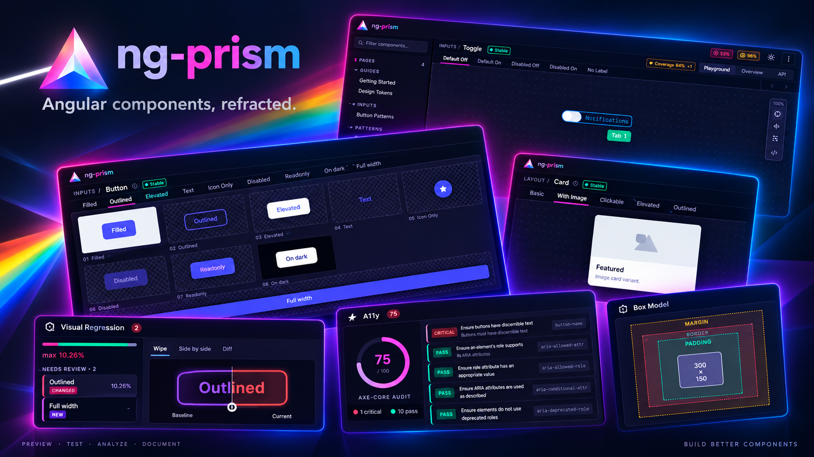

<p align="center">
  
</p>

# ng-prism

**A component showcase for modern Angular, without story files.**
Add one decorator to your component. ng-prism finds it at build time and generates live controls, code snippets and docs.

[](https://www.npmjs.com/package/@ng-prism/core)
[](https://www.npmjs.com/package/@ng-prism/core)
[](https://angular.dev)
[](https://www.typescriptlang.org)
[](./LICENSE)

**[▶ Live Demo](https://dyingangel666.github.io/ng-prism/demo/?component=ButtonComponent)** · **[Documentation](https://dyingangel666.github.io/ng-prism/)**

<!-- TODO(maintainer): record a 10–15 s GIF: pick component in sidebar → switch
     variant → change a control → code snippet updates. Save as docs/demo.gif
     and uncomment the line below.
<p align="center"></p>
-->

## Same button, two approaches

<table>
<tr><th>Storybook</th><th>ng-prism</th></tr>
<tr>
<td valign="top">

```ts
// button.stories.ts (separate file)
import type { Meta, StoryObj } from '@storybook/angular';
import { ButtonComponent } from './button.component';

const meta: Meta<ButtonComponent> = {
    title: 'Atoms/Button',
    component: ButtonComponent,
    argTypes: {
        variant: {
            control: 'select',
            options: ['primary', 'secondary', 'danger']
        }
    }
};
export default meta;
type Story = StoryObj<ButtonComponent>;

export const Primary: Story = {
    args: { variant: 'primary', label: 'Click me' }
};
export const Danger: Story = {
    args: { variant: 'danger', disabled: true }
};
```

</td>
<td valign="top">

<!-- prettier-ignore -->
```ts
// button.component.ts (right where it lives)
@Showcase<ButtonComponent>({
    title: 'Button',
    category: 'Atoms',
    variants: [
        { name: 'Primary',
          inputs: { variant: 'primary', label: 'Click me' } },
        { name: 'Danger',
          inputs: { variant: 'danger', disabled: true } }
    ]
})
@Component({ /* ... */ })
export class ButtonComponent { /* ... */ }
```

Controls are inferred from your `input()` types.
No `argTypes`, no extra file, type-checked variants.

</td>
</tr>
</table>

## Does `@Showcase` end up in my production bundle?

No, though two things are needed for that.

The decorator is a runtime no-op. It takes your config, returns an empty function and stores nothing:

```ts
export function Showcase<T = unknown>(_config: ShowcaseConfig<T>): ClassDecorator {
    return () => {};
}
```

Every piece of metadata is read at build time by the prism builder, straight from your source files via the TypeScript Compiler API. Nothing is registered, reflected or looked up while your application runs.

The decorator call itself still has to go. When ng-packagr compiles your library it lowers the decorator into a top-level call, and a top-level call is a side effect that tree-shaking is not allowed to drop:

```js
import { Showcase } from '@ng-prism/core';
Showcase({ title: 'Button', category: 'Atoms' })(ButtonComponent);
```

So ng-prism ships an AST transformer that removes those calls together with their imports. `ng add` registers it as a `strip-showcase` script in your `package.json`:

```bash
ng build my-lib && npm run strip-showcase
```

Afterwards your published library has no reference to `@ng-prism/core` left: `grep -r "@ng-prism/core" dist/my-lib/` comes back empty. Keep the package as a `devDependency`; consumers of your library never see it.

Details, including Nx targets and programmatic use: [Publishing Libraries with @Showcase](https://dyingangel666.github.io/ng-prism/#/guide/library-publishing).

## Why not Storybook?

Storybook is great. ng-prism has a narrower scope: it supports one framework and tries to do it natively.

|                     | Storybook                                 | ng-prism                                                            |
| ------------------- | ----------------------------------------- | ------------------------------------------------------------------- |
| Frameworks          | React, Vue, Angular, ...                  | Angular only                                                        |
| Where variants live | Separate `*.stories.ts`                   | On the component                                                    |
| Controls            | Configured via `argTypes` / Compodoc      | Inferred from `input()` signals                                     |
| Visual regression   | Chromatic (paid SaaS) or community addons | Official plugin, works with your own screenshot runner, no SaaS     |
| Accessibility       | `@storybook/addon-a11y`                   | Built in (axe-core)                                                 |
| Design handoff      | Design addons                             | Official Figma plugin, with an opt-in pixel diff against the design |
| Interaction tests   | Yes (play functions)                      | No                                                                  |
| Addon ecosystem     | Huge                                      | Small (official plugins)                                            |

**Choose Storybook** if you need multiple frameworks, its addon ecosystem, or interaction testing today.
**Choose ng-prism** if you're on modern, signal-based Angular and want your showcase to stay in sync with your components without maintaining story files.

## Features

- **Zero-config discovery**: TypeScript Compiler API scans your library at build time
- **Signal-native**: works with `input()` / `output()` signals
- **Type-safe variants**: opt-in `@Showcase<MyComponent>` generic gives autocomplete + compile-time checks on variant `inputs`
- **Live Controls**: auto-generated input controls with type-aware editors
- **Code Snippets**: live-updating Angular template snippets per variant
- **Accessibility built in**: axe-core audits per variant, no plugin needed
- **Visual regression**: per-variant diff report next to the component; your own screenshot runner writes a plain JSON report (the worked example drives Playwright)
- **Directive support**: showcase directives with configurable host elements
- **Component Pages**: free-form demo pages for complex components
- **Deep-linking**: URL state sync for sharing specific component/variant/view
- **Themeable**: full CSS custom property system, replaceable UI sections
- **Plugin architecture**: JSDoc, Figma, Perf, Box Model, Coverage, VRT

## Quick Start

```bash
ng add @ng-prism/core      # creates the prism app, configures builders, generates ng-prism.config.ts
```

Annotate a component with `@Showcase` (see above), then:

```bash
ng run my-lib:prism        # → http://localhost:4400
```

Your component appears in the sidebar with live controls, code snippets and variant tabs.

## Configuration

```typescript
// ng-prism.config.ts
import { defineConfig } from '@ng-prism/core/config';
import { jsDocPlugin } from '@ng-prism/plugin-jsdoc';

export default defineConfig({
    plugins: [jsDocPlugin()],

    theme: {
        '--prism-primary': '#00a67e',
        '--prism-font-sans': "'Inter', sans-serif"
    },

    appProviders: [provideAnimationsAsync(), provideHttpClient()]
});
```

## Directives

Directives need a host element. Use `host` to wrap them:

```typescript
@Showcase({
  title: 'Tooltip',
  host: {
    selector: 'my-button',
    import: { name: 'ButtonComponent', from: 'my-lib' },
    inputs: { label: 'Hover me' },
  },
  variants: [
    { name: 'Top', inputs: { position: 'top', text: 'Tooltip!' } },
  ],
})
@Directive({ selector: '[myTooltip]' })
export class TooltipDirective { ... }
```

## Component Pages

For complex components that need template projections or mock data:

```typescript
providePrism(PRISM_RUNTIME_MANIFEST, config, {
    componentPages: [{ title: 'Table Demo', category: 'Data', component: TableDemoPage }]
});
```

Link to a `@Showcase`-decorated component for combined API docs + custom rendering:

```typescript
@Showcase({
  title: 'Table',
  renderPage: 'Table Demo',
  variants: [{ name: 'Default', inputs: { height: '400px' } }],
})
```

## Official Plugins

| Plugin            | Package                              | What you get                                                                                     |
| ----------------- | ------------------------------------ | ------------------------------------------------------------------------------------------------ |
| Visual Regression | `@ng-prism/plugin-visual-regression` | Per-variant diff report, side by side with the live component. Bring your own screenshot runner. |
| JSDoc             | `@ng-prism/plugin-jsdoc`             | API tables generated from your JSDoc comments                                                    |
| Figma             | `@ng-prism/plugin-figma`             | Embed the Figma frame next to the component; opt-in pixel diff against the design                |
| Coverage          | `@ng-prism/plugin-coverage`          | Test coverage per component from Istanbul/v8                                                     |
| Perf              | `@ng-prism/plugin-perf`              | Render-time profiling per variant                                                                |
| Box Model         | `@ng-prism/plugin-box-model`         | Live CSS box-model inspector                                                                     |

> Accessibility auditing (axe-core) is part of the core, no plugin needed.
> The Figma plugin's Design Diff compares a live component against its Figma design in the browser; Visual Regression compares a screenshot against the last approved baseline. They are separate features with a similar presentation.

## Requirements

- Angular >= 20
- TypeScript >= 5.5
- Components must use `input()` / `output()` signals

## Contributing

See [CONTRIBUTING.md](./CONTRIBUTING.md) for development setup, the test workspace workflow, and PR guidelines. Participation is governed by our [Code of Conduct](./CODE_OF_CONDUCT.md), and security issues have their own [private reporting channel](./SECURITY.md).

## License

[MIT](./LICENSE)
